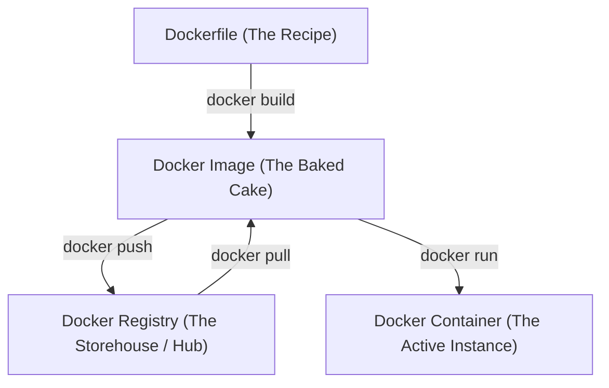

# 🐳 Standalone Docker & Dockerfile Guide

Welcome! If you have just heard about Docker and are wondering what it is, how it works, and how to set it up like an expert on Windows, macOS, or Linux—you are in the right place. This guide is written from the ground up, starting with simple analogies and scaling up to professional production-grade setup and configuration.

---

## 🚢 What is Docker? (For Complete Beginners)

Imagine you run an international shipping business. Before the mid-1950s, shipping cargo was a logistical nightmare. 
- You had to load bananas, cars, oil barrels, and sacks of grain directly onto cargo ships. 
- Sacks of grain would burst; bananas would get squashed under heavy crates; different items needed custom packing; and workers had to manually fit everything onto the ship.
- In software, this is the **"it works on my machine"** problem. Your application needs specific versions of libraries, databases, and OS configurations. When you send your code to another developer or deploy it to a server, it breaks because their environment is slightly different.

### The Solution: The Standard Shipping Container
In 1956, standard shipping containers changed the world. 
- Containers are standard-sized, metal boxes that lock together. 
- The cargo ship, cranes, and trucks don't care what is inside the container (whether it's frozen meat, high-end laptops, or raw steel). They only need to know how to stack and move standard containers.

**Docker is the shipping container system for software.**
It packages your application, its dependencies, runtime environment, system libraries, and configuration files into a standardized, isolated container. This container will run exactly the same way on a developer's Windows laptop, a macOS work machine, or a Linux cloud server.

### 🆚 Virtual Machines (VMs) vs. Containers
Many people confuse Virtual Machines with Containers. Here is how they differ:

| Feature | Virtual Machines (VMs) | Docker Containers |
| :--- | :--- | :--- |
| **Architecture** | Emulates virtual hardware. Each VM includes a complete Guest Operating System, libraries, and application code. | Shares the Host OS kernel directly. Contains only the application and its direct libraries. |
| **Size** | Very heavy (Gigabytes) | Ultra-lightweight (Megabytes) |
| **Startup Time** | Slow (Minutes, as it boots a full OS) | Instant (Milliseconds) |
| **Resource Usage** | High (Pre-allocates memory and CPU) | Highly efficient (Uses resources dynamically as needed) |

---

## 🏛️ The Four Pillars of Docker

To speak Docker fluently, you need to understand these four core concepts:



1. **Dockerfile**: A plain text file containing a sequence of commands/recipes to build your environment.
2. **Docker Image**: A read-only, immutable snapshot of your application. Think of it as the compiled/baked file generated by your Dockerfile.
3. **Docker Container**: A running, writeable instance of an image. You can start, stop, restart, delete, and log into containers.
4. **Docker Registry (e.g., Docker Hub)**: An online storehouse where developers share and store Docker images publicly or privately.

---

## 💻 Complete Installation & Expert Configuration

Choose your Operating System below to get set up.

> [!NOTE]  
> All installations below focus on enabling **Docker Engine** and modern developer tooling.

### 🪟 1. Windows Setup (WSL2 Backed)

Docker on Windows runs inside a virtualized Linux environment called **Windows Subsystem for Linux (WSL2)**.

#### Beginner Step-by-Step Installation:
1. **Enable Virtualization**: Ensure virtualization is enabled in your system BIOS/UEFI settings (typically under "Intel VT-x", "AMD-V", or "SVM"). You can check this in Windows Task Manager under the **Performance** -> **CPU** tab.
2. **Install WSL2**: Open PowerShell or Command Prompt as **Administrator** and run:
   ```powershell
   wsl --install
   ```
   *Note: Restart your computer when prompted to complete the installation.*
3. **Download Docker Desktop**: Download the Windows installer from [Docker Desktop for Windows](https://desktop.docker.com/win/main/amd64/Docker%20Desktop%20Installer.exe).
4. **Install**: Run the installer and ensure the option **"Use WSL 2 instead of Hyper-V (recommended)"** is checked.
5. **WSL Integration**: Once installed, open Docker Desktop. Go to **Settings (Gear Icon)** -> **Resources** -> **WSL Integration**, and check the box for your preferred WSL Linux distribution (e.g., `Ubuntu`).

---

#### 🛠️ Windows Expert-Level Optimization:
By default, WSL2 can consume up to 50% of your total RAM and all CPU cores. To prevent Docker from causing system lag, create a configuration file named `.wslconfig` in your Windows User Profile directory (e.g., `C:\Users\YourUsername\.wslconfig`):

```ini
# %USERPROFILE%\.wslconfig
[wsl2]
memory=4GB       # Limit memory allocation for WSL/Docker
processors=4     # Limit CPU cores allocated to WSL/Docker
localhostForwarding=true
```
Run `wsl --shutdown` in PowerShell to restart WSL and apply the resource limits.

---

### 🍎 2. macOS Setup (Apple Silicon & Intel)

macOS does not natively support Linux containers. Docker runs a lightweight Linux VM in the background.

#### Beginner Step-by-Step Installation:
1. **Download Docker Desktop**: Choose the correct installer based on your Mac's processor:
   - **Apple Silicon** (M1, M2, M3, M4 chips): [Download here](https://desktop.docker.com/mac/main/arm64/Docker.dmg)
   - **Intel Chip**: [Download here](https://desktop.docker.com/mac/main/amd64/Docker.dmg)
2. **Install**: Double-click the downloaded `.dmg` file and drag **Docker.app** to your **Applications** folder.
3. **Run**: Launch Docker from Applications. macOS will ask for your system administrator password to install the privileged networking helper.

---

#### 🛠️ macOS Expert-Level Optimization:
- **Enable VirtioFS**: For fast filesystem mounts (Crucial for Node.js, Python, and Ruby apps mounted as local directories):
  - Go to **Settings** -> **Resources** -> **File Sharing**.
  - Choose **VirtioFS** (available on macOS Ventura and later). It is significantly faster than the default gRPC Fuse.
- **Apple Silicon Rosetta Translation**: If you must build or run AMD64 (Intel-based) images on Apple Silicon, go to **Settings** -> **General** and check **"Use Virtualization framework"** and **"Use Rosetta for x86/amd64 emulation on Apple Silicon"** for high-performance translation.
- **Lightweight Alternative (Colima)**: If you want to skip Docker Desktop entirely, you can run containers using the free, open-source tool Colima:
  ```bash
  brew install colima docker docker-compose
  colima start --cpu 4 --memory 8
  ```

---

### 🐧 3. Linux Setup (Ubuntu & Fedora)

Docker runs natively on Linux, which makes it extremely fast and lightweight since no virtual machine is needed.

#### 🟠 Ubuntu/Debian Installation:
```bash
# 1. Setup Docker's repository GPG key
sudo apt-get update
sudo apt-get install -y ca-certificates curl gnupg
sudo install -m 0755 -d /etc/apt/keyrings
curl -fsSL https://download.docker.com/linux/ubuntu/gpg | sudo gpg --dearmor -o /etc/apt/keyrings/docker.gpg
sudo chmod a+r /etc/apt/keyrings/docker.gpg

# 2. Add repo to apt sources
echo \
  "deb [arch=$(dpkg --print-architecture) signed-by=/etc/apt/keyrings/docker.gpg] https://download.docker.com/linux/ubuntu \
  $(. /etc/os-release && echo "$VERSION_CODENAME") stable" | \
  sudo tee /etc/apt/sources.list.d/docker.list > /dev/null

# 3. Install packages
sudo apt-get update
sudo apt-get install -y docker-ce docker-ce-cli containerd.io docker-buildx-plugin docker-compose-plugin
```

#### 🔵 Fedora/RHEL Installation:
```bash
# 1. Install dnf plugins
sudo dnf -y install dnf-plugins-core

# 2. Add the official Docker repo
sudo dnf config-manager --add-repo https://download.docker.com/linux/fedora/docker-ce.repo

# 3. Install packages
sudo dnf install -y docker-ce docker-ce-cli containerd.io docker-buildx-plugin docker-compose-plugin
```

---

#### 🛠️ Linux Expert-Level Configuration:

##### A. Run Docker without `sudo` (Mandatory Post-Install)
By default, you must prefix every command with `sudo`. To run them as your normal user:
```bash
# 1. Create the docker group (usually already exists)
sudo groupadd docker

# 2. Add your current user to the group
sudo usermod -aG docker $USER

# 3. Apply changes immediately without logging out
newgrp docker

# 4. Enable Docker service on boot
sudo systemctl enable --now docker
```

##### B. Set Up Log Rotation (`/etc/docker/daemon.json`)
Left unconfigured, docker container logs can grow infinitely and fill up your hard drive. Prevent this by writing a global configuration file:
Create or edit `/etc/docker/daemon.json`:
```json
{
  "log-driver": "json-file",
  "log-opts": {
    "max-size": "10m",
    "max-file": "3"
  },
  "features": {
    "buildkit": true
  }
}
```
*Reload & restart the service to apply changes:*
```bash
sudo systemctl daemon-reload
sudo systemctl restart docker
```

---

## 🐳 Dockerfile Deep Dive & Expert Best Practices

A `Dockerfile` is a text file that outlines step-by-step instructions. Let's look at the basic commands first:

- `FROM <image>`: Declares the baseline operating system or runtime (e.g. `python:3.11-slim`, `node:20-alpine`).
- `WORKDIR </path>`: Sets the target directory inside the container for all subsequent commands.
- `COPY <src> <dest>`: Copies files from your local host machine to the container's filesystem.
- `RUN <command>`: Runs shell build commands (e.g., installs dependencies).
- `EXPOSE <port>`: Informs Docker which port the app runs on inside the container.
- `ENV <key>=<value>`: Sets environment variables.
- `CMD ["cmd", "args"]`: The default command executed when the container starts.

---

### 🚀 Expert Best Practices for Production Dockerfiles

#### 1. Leverage Layer Caching (Save Build Time)
Docker runs each line of a Dockerfile as an individual cacheable layer. If files on that line have not changed, it skips compilation.
- **Bad Practice** (invalidates cache on any code tweak):
  ```dockerfile
  COPY . .
  RUN pip install -r requirements.txt
  ```
- **Good Practice** (caching dependencies layer):
  ```dockerfile
  COPY requirements.txt .
  RUN pip install --no-cache-dir -r requirements.txt
  COPY . .
  ```

#### 2. Keep Images Tiny (Base Image Selection)
Never use default base images like `ubuntu` or raw `python:3.11` (~1GB) unless strictly necessary.
- Use `slim` images (e.g. `python:3.11-slim` ~120MB) for lightweight debian runtimes.
- Use `alpine` images (e.g. `node:20-alpine` ~40MB) for security-hardened, ultra-tiny setups.

#### 3. Use Multi-Stage Builds (The Gold Standard)
Split your Dockerfile into stages. Use a heavy compiler/builder stage to build libraries, then copy the output artifact into a bare, minimal runtime stage.

#### 4. Never Run as Root (Security)
By default, Docker runs applications as the system superuser (`root`). Always create and switch to a non-privileged user.

#### 5. Always Add a `.dockerignore` File
Create a `.dockerignore` file in your root folder. This prevents copying bulky build files, secrets, and IDE configs into your final image:
```ignore
# .dockerignore
.git
node_modules/
venv/
__pycache__/
.env
.ipynb_checkpoints/
*.log
```

---

### 📄 Comprehensive Expert Dockerfile Template
Here is a production-ready, secure, and optimized multi-stage `Dockerfile` for a Python web application:

```dockerfile
# ==========================================
# STAGE 1: Builder (Compiles dependencies)
# ==========================================
FROM python:3.11-slim AS builder

WORKDIR /build

# Install compilation build dependencies (gcc, headers etc.)
RUN apt-get update && apt-get install -y --no-install-recommends \
    build-essential \
    && rm -rf /var/lib/apt/lists/*

# Install requirements to user space directory
COPY requirements.txt .
RUN pip install --no-cache-dir --user -r requirements.txt


# ==========================================
# STAGE 2: Final Runtime (Ultra-light, secure)
# ==========================================
FROM python:3.11-slim AS runner

WORKDIR /app

# Create a non-privileged system user & group
RUN groupadd -r appgroup && useradd -r -g appgroup appuser

# Copy installed libraries from the builder stage
COPY --from=builder /root/.local /home/appuser/.local
COPY . .

# Adjust file ownership to the non-privileged user
RUN chown -B appuser:appgroup /app
ENV PATH=/home/appuser/.local/bin:$PATH

# Switch user context
USER appuser

EXPOSE 8080

CMD ["python", "app.py"]
```

---

## 🛠️ Essential Command Cheatsheet

Once Docker is installed, here are the most important commands to execute:

### Containers
```bash
docker run -d -p 80:80 --name myweb nginx   # Start container in background (detached)
docker ps                                   # List active containers
docker ps -a                                # List all containers (including stopped)
docker stop <container_name>                # Stop container
docker rm <container_name>                  # Delete container
docker exec -it <container_name> bash       # Open terminal shell inside running container
docker logs -f <container_name>             # Live-stream container console logs
```

### Images
```bash
docker build -t myapp:1.0 .                 # Build an image from local Dockerfile
docker images                               # List local images
docker rmi <image_id>                       # Delete local image
```

### Cleanup
```bash
docker system prune -a --volumes            # Clear ALL stopped containers, unused networks, volumes, and cached images (Free up Disk Space!)
```

---

## 🐚 Shell Syntax Differences (Bash vs. PowerShell vs. Windows CMD)

If you are running Docker commands on Windows, the exact command syntax changes depending on which terminal environment you use: **Bash (Linux/macOS/WSL)**, **PowerShell (Windows default)**, or **Windows Command Prompt (CMD)**.

### 1. Mounting the Current Directory as a Volume (`-v`)
When mounting your current working folder into a container to synchronize local source files:
- **Bash (Linux/macOS/WSL/Git Bash)**: Uses `$(pwd)`
  ```bash
  docker run -d -p 8080:80 -v $(pwd):/usr/share/nginx/html nginx
  ```
- **PowerShell**: Uses `${PWD}`
  ```powershell
  docker run -d -p 8080:80 -v ${PWD}:/usr/share/nginx/html nginx
  ```
- **Windows Command Prompt (CMD)**: Uses `%cd%` (case-insensitive)
  ```cmd
  docker run -d -p 8080:80 -v %cd%:/usr/share/nginx/html nginx
  ```

### 2. Multi-line Command Continuation
When writing long Docker commands split across multiple lines for clean readability:
- **Bash (Linux/macOS/WSL/Git Bash)**: Use a backslash `\` at the end of each line:
  ```bash
  docker build \
    -t webapp:latest \
    --build-arg API_URL=http://localhost:5000 \
    .
  ```
- **PowerShell**: Use a backtick `` ` `` at the end of each line:
  ```powershell
  docker build `
    -t webapp:latest `
    --build-arg API_URL=http://localhost:5000 `
    .
  ```
- **Windows Command Prompt (CMD)**: Use a caret `^` at the end of each line:
  ```cmd
  docker build ^
    -t webapp:latest ^
    --build-arg API_URL=http://localhost:5000 ^
    .
  ```

### 3. Running with Temporary Environment Variables
If you want to pass dynamic configuration variables to the run environment:
- **Bash (Linux/macOS/WSL/Git Bash)**: Declare inline directly before the command:
  ```bash
  DEBUG=true PORT=8080 docker run -d -p 80:80 nginx
  ```
- **PowerShell**: Define using the `$env:` prefix (separated by a semicolon `;`):
  ```powershell
  $env:DEBUG="true"; $env:PORT="8080"; docker run -d -p 80:80 nginx
  ```
- **Windows Command Prompt (CMD)**: Set using the `set` command (separated by `&&`):
  ```cmd
  set DEBUG=true && set PORT=8080 && docker run -d -p 80:80 nginx
  ```

---

## 📚 Educational & Execution Resources

Use these links and tools to master and test your Docker skills.

### 📖 Learning Resources
1. **[Docker Official Docs](https://docs.docker.com/)**: Extremely well-written guides, tutorials, and full command references.
2. **[Roadmap.sh Docker Guide](https://roadmap.sh/docker)**: A step-by-step learning pathway outlining the prerequisites, advanced concepts, and visual roadmaps.
3. **[TechWorld with Nana (Docker Video Course)](https://www.youtube.com/watch?v=3c-iHsQLwTE)**: A visually engaging, free 3-hour tutorial video for complete beginners.
4. **[Docker Cheat Sheet](https://dockerlabs.collabnix.com/docker/cheatsheet/)**: A handy quick reference for command-line options and parameters.

### ⚙️ Executing & Testing Resources
1. **[Play with Docker (PWD)](https://labs.play-with-docker.com/)**: A free, browser-based Docker sandbox. You can start virtual Linux terminals with Docker installed right in your web browser without installing anything locally.
2. **[Lazydocker TUI](https://github.com/jesseduffield/lazydocker)**: A highly interactive, terminal-based dashboard (TUI) to visualize, manage, and debug containers, images, volumes, and logs without typing raw CLI commands.
3. **[VS Code Docker Extension](https://marketplace.visualstudio.com/items?itemName=ms-azuretools.vscode-docker)**: Add full editor support to write Dockerfiles and Compose files, with built-in autocomplete, image building, and container inspection.
4. **[Docker Hub Registry](https://hub.docker.com/)**: The standard directory of pre-packaged images for databases (PostgreSQL, Redis), servers (Nginx), and code runtimes.
5. **[GitHub Container Registry (GHCR)](https://github.com/features/packages)**: Build and push your private/public docker containers directly alongside your code repositories.
6. **Container Cloud Platforms (Run in production)**:
   - **[Google Cloud Run](https://cloud.google.com/run)**: Build containers locally, push to cloud, and run on demand.
   - **[Fly.io](https://fly.io/)**: Run dockerized apps close to your users globally.
